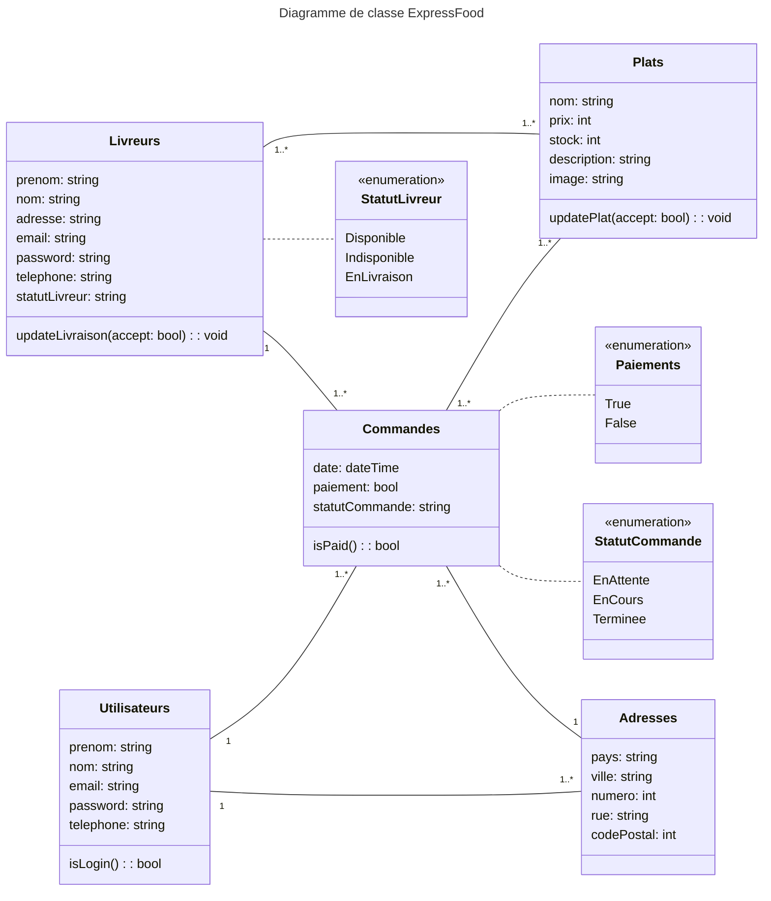

```mermaid
---
title: Diagramme de classe ExpressFood
---

classDiagram
    direction LR
    class Utilisateurs{
        prenom: string
        nom: string 
        email: string 
        password: string 
        telephone: string 
        isLogin(): bool
    }
    class Adresses{
        pays: string 
        ville: string 
        numero: int 
        rue: string 
        codePostal: int 
    }
    class Plats{
        nom: string 
        prix: int 
        stock: int 
        description: string 
        image: string 
        updatePlat(accept: bool): void
    }
    class Commandes{
        date: dateTime 
        paiement: bool 
        statutCommande: string 
        isPaid(): bool
    }
    class Paiements{
        <<enumeration>>
        True
        False
    }
    class StatutCommande{
        <<enumeration>>
        EnAttente
        EnCours
        Terminee
    }
    class Livreurs{
        prenom: string 
        nom: string 
        adresse: string 
        email: string 
        password: string 
        telephone: string 
        statutLivreur: string 
        updateLivraison(accept: bool): void
    }
    class StatutLivreur{
        <<enumeration>>
        Disponible
        Indisponible
        EnLivraison
    }
    Adresses "1..*" -- "1" Utilisateurs
    Utilisateurs "1" -- "1..*" Commandes
    Commandes "1..*" -- "1..*" Plats
    Livreurs "1..*" -- "1..*" Plats
    Commandes .. Paiements
    Commandes .. StatutCommande
    Livreurs .. StatutLivreur
    Livreurs "1" -- "1..*" Commandes
    Commandes "1..*" -- "1" Adresses
```