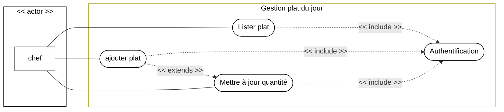

```mermaid

flowchart LR
    subgraph actor [<< actor >>]
        chef[chef]
    end

    subgraph system [Gestion plat du jour]
        direction TB
        auth([Authentification])
        listerPlat([Lister plat])
        ajout([ajouter plat])
        quantity([Mettre à jour quantité])
    end

    class chef noBorder
    class actor,chef,auth,ajout,listerPlat,quantity noBG
    class actor,chef,auth,ajout,listerPlat,quantity,system whiteBG
    class system blackFont
    classDef noBG stroke:#000000, color:#000000
    classDef whiteBG fill:#ffffff
    classDef blackFont color:#000000
    classDef noBorder stroke: #ffffff

    chef --- listerPlat & ajout & quantity
    ajout & listerPlat & quantity-. << include >>..-> auth
    ajout -. << extends >>.-> quantity

```
