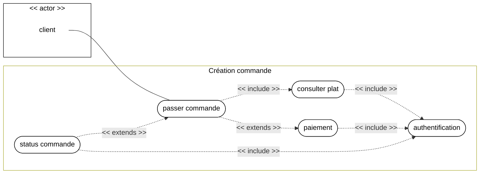

```mermaid
flowchart LR
    subgraph actor [<< actor >>]
        client[client]
    end

    subgraph system [Création commande]
        direction TB
        passerCommande([passer commande])
        auth([authentification])
        paiement([paiement])
        status([status commande])
        consulter([consulter plat])
        end

    class actor,client,passerCommande,auth,paiement,status,consulter noBG
    class actor,client,passerCommande,auth,paiement,status,consulter,system whiteBG
    class client noBorder
    class system blackFont
    classDef noBG stroke:#000000, color:#000000
    classDef whiteBG fill:#ffffff
    classDef blackFont color:#000000
    classDef noBorder stroke: #ffffff

    client --- passerCommande

    passerCommande -. << include >> .-> consulter
    consulter & paiement & status -. << include >> .-> auth
    passerCommande -. << extends >> .-> paiement
    status -. << extends >> .-> passerCommande
```
