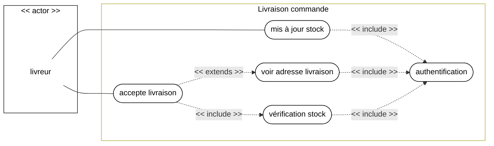

```mermaid
flowchart LR
    subgraph actor [<< actor >>]
        livreur[livreur]
    end
    subgraph system [Livraison commande]
        direction TB
        auth([authentification])
        verif([vérification stock])
        stock([mis à jour stock])
        livraison([accepte livraison])
        adresse([voir adresse livraison])
    end

    class actor,livreur,auth,verif,stock,livraison,adresse border
    class actor,livreur,auth,verif,stock,livraison,adresse,system whiteBG
    class system blackFont
    class livreur noBorder
    classDef border stroke:#000000, color:#000000
    classDef whiteBG fill:#ffffff
    classDef blackFont color:#000000
    classDef noBorder stroke: #ffffff

    stock -. << include >>.-> auth
    livreur --- livraison & stock
    adresse & verif -. << include >>.-> auth 
    livraison -. << extends >>.-> adresse
    livraison -. << include >>.-> verif

```
